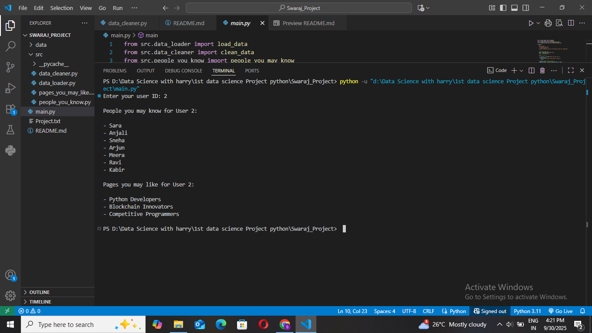
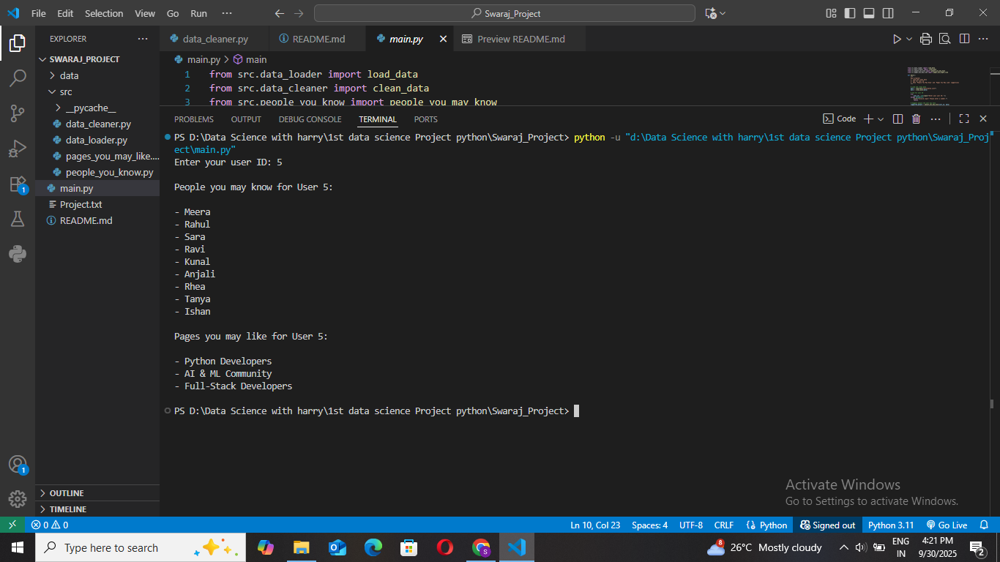

# 📌 Social Network Recommendation System

## 🚀 Project Overview
This project is a **Social Network Recommendation System** that provides personalized suggestions for users on a social network platform.  
It suggests:

- **People You May Know**: Based on mutual friends.  
- **Pages You May Like**: Based on shared interests and liked pages.  

The project demonstrates a simple **Data Science workflow** with data loading, cleaning, analysis, and recommendation logic using Python.

---

## 🛠️ Features
- Load JSON-based social network data.
- Clean data:
  - Remove users with empty names.
  - Remove duplicate friends.
  - Remove inactive users (no friends & no liked pages).
  - Remove duplicate pages (keep only the latest).
- Recommend users to connect with based on mutual friends.
- Suggest pages a user might like based on shared interests.
- Interactive command-line interface for user input.

---


## 📁 Project Structure
```
social-network-recommender/
│
├── data/                             # JSON datasets
│ └── data2.json
|
├── src/                               # Python modules
│ ├── data_loader.py                   # Load JSON data
│ ├── data_cleaner.py                  # Clean the data
│ ├── people_you_know.py               # Suggest people
│ └── pages_you_may_like.py            # Suggest pages
|                                   
├── main.py                            # Main program to run recommendations


```


## 🔧 Installation

1. **Clone the repository:**
```bash
git clone https://github.com/yourusername/social-network-recommender.git
```

2. **Navigate to the project folder:**
```bash
cd social-network-recommender
```

3. **Run the main program:**
```bash
python main.py
```

## 💡 Usage

1. **Run the script:**
```bash
python main.py
```

**Enter your User ID when prompted.**

**View the personalized recommendations:**

- People you may know

- Pages you may like

## Example Output:



---



## 📚 How It Works

- Load Data: Reads user and page data from a JSON file.

- Clean Data: Removes inconsistencies and duplicates.

- People Recommendation: Suggests users based on mutual friends.

- Page Recommendation: Suggests pages based on shared interests and interactions.

- Interactive Input: User enters their ID to get personalized suggestions.
